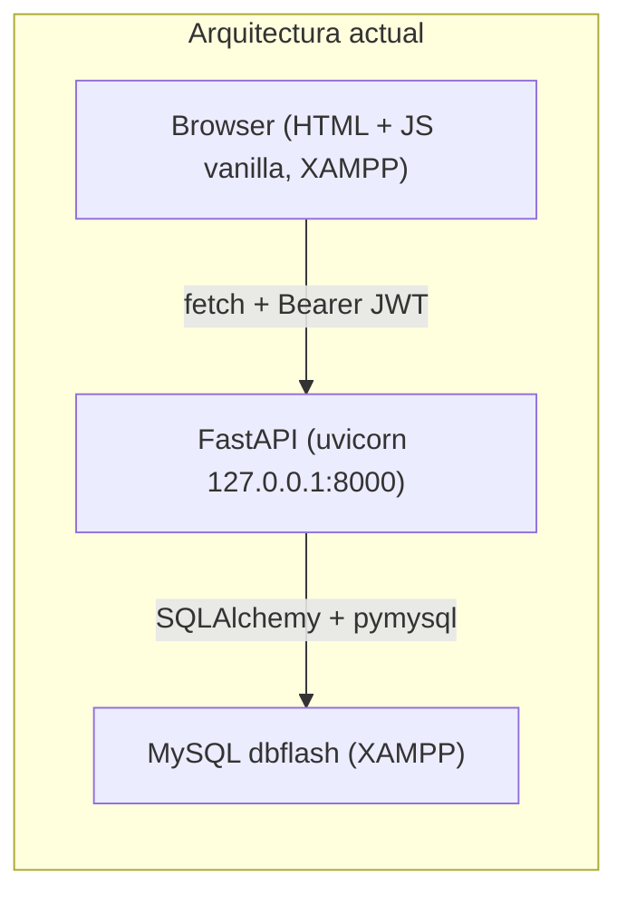
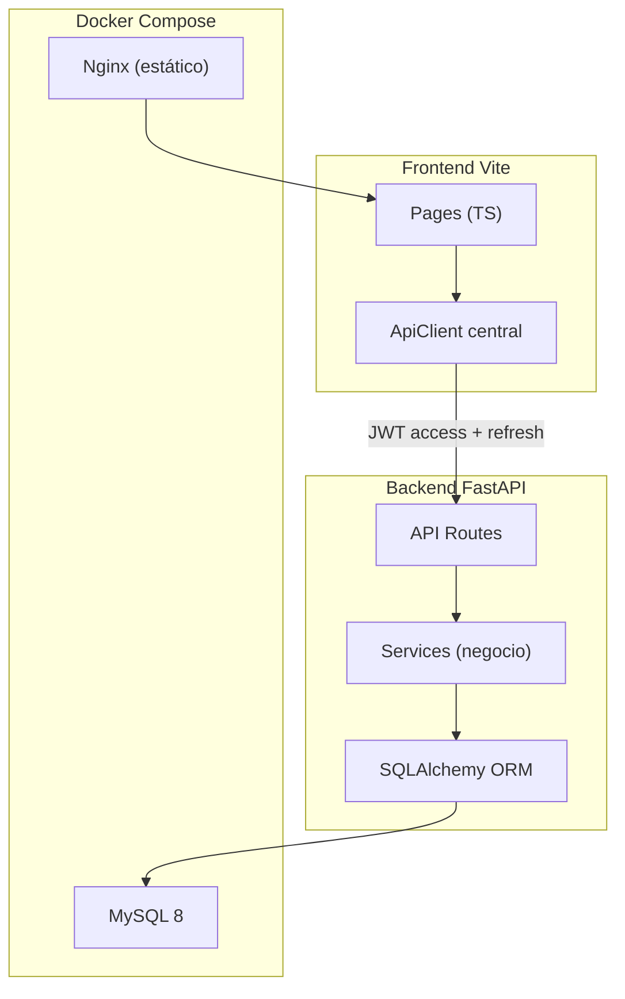
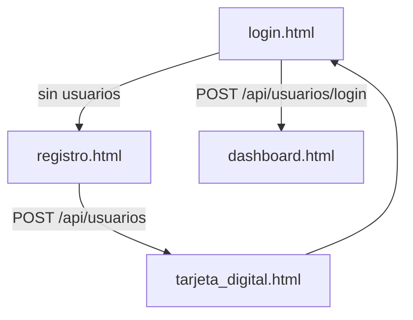
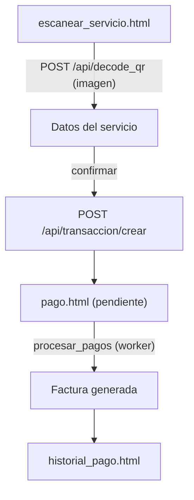

# Arquitectura

## Arquitectura actual

El proyecto es un prototipo de dos piezas débilmente acopladas: un frontend estático
servido por XAMPP y una API FastAPI que habla con MySQL. No hay contenedores ni
configuración por entorno; las URLs y credenciales están hardcodeadas.



Puntos débiles estructurales:

- El frontend apunta a `http://127.0.0.1:8000` hardcodeado en cada `controllers/*.js`.
- La lógica de negocio vive dentro de los routers (`api/private/api_*.py`), sin capa de servicios.
- Cada modelo define su propio `declarative_base()`, así que no hay relaciones ORM ni
  integridad declarada en Python.
- Las búsquedas usan un árbol binario en memoria global compartido entre requests
  ([api/helpers/arbol_binario.py](../api/helpers/arbol_binario.py)).
- El procesamiento de pagos (`procesar_pagos`) se dispara desde el navegador cada 5 s
  y sin autenticación.

## Estructura de código actual

```
Flash/
├── api/
│   ├── api.py                 # Entrada FastAPI, CORS, registro de routers
│   ├── helpers/
│   │   ├── database.py        # Conexión SQLAlchemy + get_db()
│   │   ├── tokens.py          # Verificación JWT (usuario y tarjeta)
│   │   └── arbol_binario.py   # BST en memoria (búsquedas)
│   ├── models/                # Modelos ORM (uno por tabla)
│   ├── schemas/               # DTOs Pydantic
│   └── private/               # Routers por dominio (endpoints)
├── views/                     # Páginas HTML
├── controllers/               # Lógica JS por página
├── css/                       # Estilos + fuente
├── resources/                 # JS de terceros (SweetAlert2)
└── dbflash.sql                # Esquema + datos semilla
```

## Arquitectura objetivo

Monorepo con backend y frontend desacoplados, todo contenedorizado y configurado por
variables de entorno. Inspirado en `full-stack-fastapi-template`.



## Estructura de carpetas objetivo

```
flash/
├── backend/
│   └── app/
│       ├── main.py            # antes api/api.py
│       ├── api/
│       │   ├── deps.py        # get_db, get_current_user
│       │   └── routes/        # antes api/private/api_*.py
│       ├── core/
│       │   ├── config.py      # Settings desde .env
│       │   └── security.py    # antes helpers/tokens.py
│       ├── models/            # ORM unificado
│       ├── schemas/           # Pydantic v2
│       ├── services/          # recarga, débito, facturación
│       └── db/
│           ├── session.py     # antes helpers/database.py
│           └── base.py        # declarative_base único
├── frontend/
│   ├── src/
│   │   ├── pages/             # antes views/ + controllers/
│   │   ├── api/               # cliente fetch centralizado
│   │   ├── components/
│   │   └── lib/               # tokens, validaciones
│   ├── index.html
│   ├── vite.config.ts
│   └── package.json
├── docs/
├── docker-compose.yml
├── .github/workflows/ci.yml
├── .gitignore
├── .env.example
├── LICENSE
└── README.md
```

## Mapeo de migración

| Hoy | Destino |
|-----|---------|
| `api/api.py` | `backend/app/main.py` |
| `api/private/api_*.py` | `backend/app/api/routes/*.py` |
| `api/models/` | `backend/app/models/` |
| `api/schemas/` | `backend/app/schemas/` |
| `api/helpers/database.py` | `backend/app/db/session.py` |
| `api/helpers/tokens.py` | `backend/app/core/security.py` |
| `controllers/*.js` + `views/*.html` | `frontend/src/pages/` |
| `dbflash.sql` | `backend/alembic/versions/001_initial.py` |

## Flujos de negocio principales

### Registro, login y tarjeta



### Pago de servicio vía QR



En la arquitectura objetivo, `procesar_pagos` deja de ser un endpoint público invocado
por el navegador y pasa a ejecutarse como tarea programada (worker/cron) autenticada.
