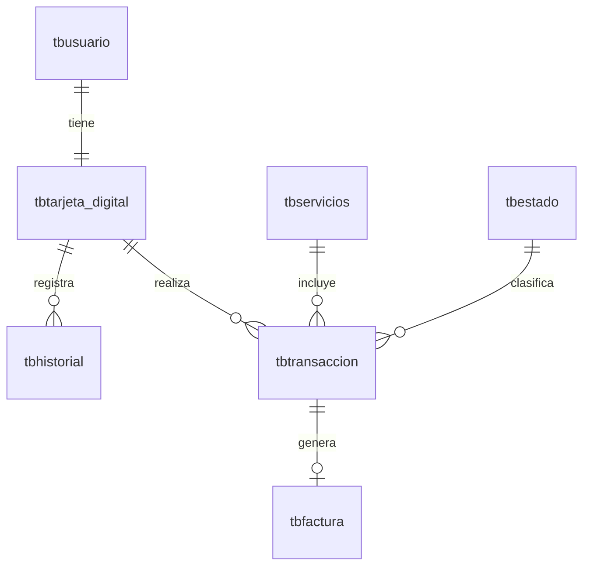

# Base de datos

## Modelo entidad-relación



## Tablas

### tbusuario
| Columna | Tipo | Restricciones |
|---------|------|---------------|
| id_usuario | INT | PK, AUTO_INCREMENT |
| nombres | VARCHAR(50) | NOT NULL |
| apellidos | VARCHAR(50) | NOT NULL |
| direccion | VARCHAR(150) | NOT NULL |
| telefono | VARCHAR(15) | NOT NULL |
| email | VARCHAR(50) | NOT NULL, UNIQUE |
| usuario | VARCHAR(50) | NOT NULL, UNIQUE |
| contra | VARCHAR(500) | NOT NULL (hash bcrypt) |
| img_usuario | VARCHAR(100) | NULL |

### tbtarjeta_digital
| Columna | Tipo | Restricciones |
|---------|------|---------------|
| id_tarjeta | INT | PK, AUTO_INCREMENT |
| pan | VARCHAR(19) | NOT NULL, UNIQUE |
| cvc | TINYINT UNSIGNED | |
| balance | DECIMAL(7,2) | NOT NULL |
| fecha_creacion | DATE | NOT NULL |
| fecha_actualizacion | DATETIME | NOT NULL |
| id_usuario | INT | NOT NULL, UNIQUE, FK -> tbusuario |

### tbhistorial (depósitos / recargas)
| Columna | Tipo | Restricciones |
|---------|------|---------------|
| id_historial | INT | PK, AUTO_INCREMENT |
| monto_agregado | DECIMAL(7,2) | NOT NULL |
| fecha_historial | DATE | NOT NULL |
| hora_historial | TIME | NOT NULL |
| id_tarjeta | INT | NOT NULL, FK -> tbtarjeta_digital |

### tbservicios
| Columna | Tipo | Restricciones |
|---------|------|---------------|
| id_servicio | INT | PK, AUTO_INCREMENT |
| nombre | VARCHAR(30) | NOT NULL, UNIQUE |
| img_servicio | VARCHAR(100) | NOT NULL |

Semilla: Claro, Tigo, Movistar, Tropigas, ANDA, AES, DELSUR.

### tbestado
| Columna | Tipo | Restricciones |
|---------|------|---------------|
| id_estado | INT | PK, AUTO_INCREMENT |
| estado | VARCHAR(10) | NOT NULL |

Semilla: `1 = Pendiente`, `2 = En espera`, `3 = Completada`.

### tbtransaccion
| Columna | Tipo | Restricciones |
|---------|------|---------------|
| id_transaccion | INT | PK, AUTO_INCREMENT |
| fecha_transaccion | DATE | NOT NULL |
| hora_transaccion | TIME | NOT NULL |
| monto | DECIMAL(7,2) | NOT NULL |
| frecuencia | INT | NOT NULL |
| descripcion | VARCHAR(40) | NOT NULL |
| id_tarjeta | INT | NOT NULL, FK -> tbtarjeta_digital |
| id_servicio | INT | NOT NULL, FK -> tbservicios |
| id_estado | INT | NOT NULL, FK -> tbestado |

### tbfactura
| Columna | Tipo | Restricciones |
|---------|------|---------------|
| id_factura | INT | PK, AUTO_INCREMENT |
| fecha_factura | DATE | NOT NULL |
| hora_factura | TIME | NOT NULL |
| monto_total | DECIMAL(6,2) | NOT NULL |
| id_transaccion | INT | NOT NULL, FK -> tbtransaccion |

## Problemas a corregir

### 1. Bug de sintaxis en `dbflash.sql` (bloqueante)

En [dbflash.sql](../dbflash.sql), la definición de `tbtarjeta_digital` omite la coma tras `cvc`:

```sql
cvc TINYINT UNSIGNED        -- falta la coma
balance DECIMAL(7,2) NOT NULL,
```

Debe ser:

```sql
cvc TINYINT UNSIGNED,
balance DECIMAL(7,2) NOT NULL,
```

Sin esta corrección la tabla no se crea y falla toda la carga del esquema.

### 2. Semántica de estados inconsistente

El código de negocio usa `id_estado == 1` como "fallido / saldo insuficiente", pero en la
semilla `1 = Pendiente`. Hay que unificar: definir un catálogo claro (por ejemplo
`Pendiente`, `En espera`, `Completada`, `Fallida`) y usar constantes/enum en el backend en
lugar de números mágicos.

### 3. Tipo de `id_usuario` en el modelo

En el modelo ORM `tarjeta.py`, `id_usuario` está declarado como `String(50)`, pero en SQL es
`INT`. Alinear ambos a `INT`.

### 4. Múltiples `declarative_base()`

Cada modelo define su propia base, así que no hay relaciones ORM ni `ForeignKey` en Python.
Unificar en un único `Base` en `backend/app/db/base.py` y declarar relaciones y FKs.

## Migraciones con Alembic

Objetivo: dejar de mantener `dbflash.sql` a mano y versionar el esquema.

1. Añadir Alembic al backend y configurar `sqlalchemy.url` desde `Settings`.
2. Generar la migración inicial (`001_initial`) que reproduzca el esquema corregido.
3. Crear una migración/seed de datos para `tbestado` y `tbservicios`.
4. En adelante, todo cambio de esquema pasa por `alembic revision --autogenerate`.

`dbflash.sql` se conservará como referencia histórica hasta completar la Fase 1.

## Integridad y consistencia

- Envolver recarga y débito de saldo en transacciones atómicas (`db.begin()`), validando
  saldo suficiente antes de debitar.
- Añadir un patrón de ledger (movimientos inmutables) para auditar cada cambio de balance,
  en lugar de solo mutar `balance` en la tarjeta.
