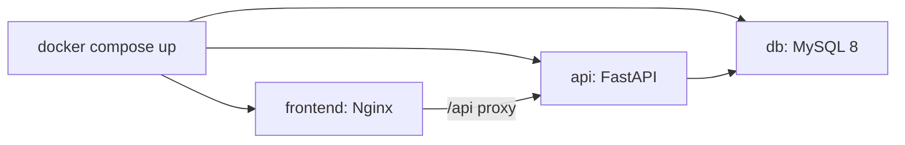

# Docker y contenedorización

## Objetivo

Que cualquier persona pueda levantar todo Flash con un solo comando, sin instalar XAMPP:

```bash
docker compose up
```

Servicios:

- `db`: MySQL 8 con el esquema y datos semilla.
- `api`: FastAPI (uvicorn) conectada a `db`.
- `frontend`: Nginx sirviendo el build estático de Vite (Fase 3).



## Fase 3a: solo la base de datos (salto mínimo desde XAMPP)

Primer paso: mover únicamente MySQL a Docker y seguir corriendo la API en local con hot reload.

```yaml
services:
  db:
    image: mysql:8
    environment:
      MYSQL_ROOT_PASSWORD: ${MYSQL_ROOT_PASSWORD}
      MYSQL_DATABASE: ${MYSQL_DATABASE}
    ports:
      - "3306:3306"
    volumes:
      - db_data:/var/lib/mysql
      - ./dbflash.sql:/docker-entrypoint-initdb.d/001_schema.sql:ro
    healthcheck:
      test: ["CMD", "mysqladmin", "ping", "-h", "localhost"]
      interval: 10s
      timeout: 5s
      retries: 5

volumes:
  db_data:
```

## Fase 3b: API contenedorizada

`backend/Dockerfile` multi-stage:

```dockerfile
FROM python:3.12-slim AS base
WORKDIR /app
COPY requirements.txt .
RUN pip install --no-cache-dir -r requirements.txt
COPY app ./app
EXPOSE 8000
CMD ["uvicorn", "app.main:app", "--host", "0.0.0.0", "--port", "8000"]
```

Añadir el servicio `api` al compose:

```yaml
  api:
    build: ./backend
    environment:
      DATABASE_URL: ${DATABASE_URL}
      SECRET_KEY: ${SECRET_KEY}
      CORS_ORIGINS: ${CORS_ORIGINS}
    ports:
      - "8000:8000"
    depends_on:
      db:
        condition: service_healthy
```

## Fase 3c: frontend con Nginx

`frontend/Dockerfile`:

```dockerfile
FROM node:22-alpine AS build
WORKDIR /app
COPY package*.json ./
RUN npm ci
COPY . .
RUN npm run build

FROM nginx:alpine
COPY --from=build /app/dist /usr/share/nginx/html
```

Servicio `frontend` en el compose, con Nginx haciendo proxy de `/api` hacia `api:8000`.

## Variables de entorno

Todas viven en `.env` (no versionado). Ver [.env.example](../.env.example) en la raíz.

| Variable | Ejemplo | Uso |
|----------|---------|-----|
| `MYSQL_ROOT_PASSWORD` | `cambia_esto` | Password root de MySQL |
| `MYSQL_DATABASE` | `dbflash` | Nombre de la base |
| `DATABASE_URL` | `mysql+pymysql://root:cambia_esto@db/dbflash` | Conexión del backend |
| `SECRET_KEY` | (token_hex 32) | Firma de JWT (rotada) |
| `CORS_ORIGINS` | `http://localhost:5173` | Orígenes permitidos |
| `JWT_EXPIRE_MINUTES` | `15` | Expiración del access token |
| `VITE_API_URL` | `http://localhost:8000` | Base URL del frontend |

## Healthchecks

- `db`: `mysqladmin ping`.
- `api`: endpoint `/health` (a añadir) o `/docs`.
- El compose usa `depends_on` con `condition: service_healthy` para arrancar en orden.

## override para desarrollo

`docker-compose.override.yml` monta volúmenes de código y activa `--reload` para hot reload
en desarrollo, sin afectar la configuración de producción.
