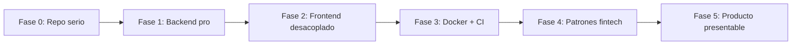

# Roadmap de profesionalización

Migración incremental de prototipo a producto. Cada fase es entregable por sí sola: al
terminarla, Flash sigue funcionando y queda en mejor estado que antes.

## Fase 0 - Repo serio (1-2 días)

Cero cambios funcionales; el objetivo es poder publicar con seguridad.

- [x] Crear `docs/`, `README.md` raíz, `LICENSE` (MIT).
- [x] Crear `.gitignore` y `.env.example`.
- [x] Mover `SECRET_KEY` y `DATABASE_URL` a `.env`; rotar la clave (nueva clave en `.env` local).
- [x] Crear `requirements.txt` con las dependencias actuales.
- [x] Corregir el bug de sintaxis en `dbflash.sql`.
- [x] `git init`, primer commit y push a `origin/develop` en https://github.com/Lenny004/flash_wallet.

**Done:** el proyecto es publicable, sin secretos en el código, con documentación y README.

## Fase 1 - Backend profesional (1-2 semanas)

- [x] Reorganizar `api/` -> `backend/app/` (copiado; `api/` legacy se mantiene temporalmente).
- [x] `core/config.py` con Pydantic Settings.
- [x] Unificar `declarative_base` y declarar Base única.
- [x] Introducir Alembic (esqueleto listo; falta migración inicial generada).
- [~] Estandarizar respuestas y errores; usar `response_model` (parcial: `/health`, `GET /api/usuarios/`).
- [x] Tests con pytest de humo y guards de auth (401 sin token); faltan tests de login/QR con DB.
- [x] `ruff` configurado (`ruff.toml`; lint en CI; sin `--fix` masivo aún).
- [x] Docker Compose solo para MySQL (siguiente paso incremental).

**Done:** backend testeable, con migraciones versionadas y configuración por entorno.

## Fase 2 - Frontend desacoplado (2-3 semanas)

- [x] Crear scaffold `frontend/` con Vite + TypeScript (`apiFetch`, proxy `/api`).
- [x] Copiar HTML/CSS/controllers/resources a `frontend/public/` (servidos por Vite).
- [ ] Unificar `controllers/*.js` en módulos ES.
- [x] `src/api/client.ts` con `baseURL` desde `VITE_API_URL`.
- [x] Proxy `/api` en `vite.config` hacia `localhost:8000`.
- [ ] Guards de sesión por página (online.js ya valida token).

## Fase 3 - Docker end-to-end (1 semana)

- [x] `docker-compose.yml`: `db` + `api` + `frontend` (nginx).
- [x] `Dockerfile` para backend y frontend.
- [~] `.github/workflows/ci.yml`: lint + pytest + build frontend (falta build Docker en CI).
- [x] Endpoint `/health` + healthcheck del servicio `api`.

**Done:** `docker compose up` levanta todo; CI verde en cada PR.

## Fase 4 - Patrones fintech (2-4 semanas, incremental)

- [x] Autenticar endpoints mutables críticos (deletes, procesar_pagos, QR); falta auditoría completa.
- [x] Transacciones atómicas para recarga/débito (`services/wallet.py` + `with_for_update`).
- [x] Ledger de movimientos (audit trail).
- [x] QR con expiración / payment intent firmado.
- [x] Quitar pan/cvc del JWT de tarjeta; refresh tokens implementados (`POST /api/usuarios/refresh`).
- [x] Convertir `procesar_pagos` en worker/cron en vez de polling desde el navegador.
- [x] Reemplazar el BST en memoria por consultas SQL.

**Done:** operaciones financieras seguras, auditables y sin endpoints abiertos.

## Fase 5 - Producto presentable (opcional)

- [ ] Migrar páginas críticas (login, dashboard, pago) a React + TanStack Query.
- [ ] Confirmación de pago en tiempo real (WebSocket/SSE).
- [ ] Evaluar PostgreSQL si el despliegue cloud lo requiere.
- [ ] Deploy: Railway/Render/Fly.io (API) + Vercel/Netlify (frontend).
- [x] CHANGELOG y versionado semántico (`CHANGELOG.md`, `version="0.2.0"` en FastAPI).

**Done:** Flash desplegado, con dominio, HTTPS y experiencia moderna.

## Prioridades inmediatas (top 5)

1. Unificar `controllers/*.js` en módulos ES (import/export, sin globals duplicados).
2. Eliminar carpetas legacy (`api/`, `views/`, `controllers/`, `css/`) cuando Vite cubra todo el flujo.
3. Desplegar en cloud: API (Railway/Render/Fly.io) + frontend estático (Vercel/Netlify) con HTTPS.
4. Blacklist de refresh tokens en logout (revocación server-side, no solo `localStorage.clear`).
5. Guards de sesión unificados en todas las páginas (hoy solo `online.js` valida token de forma consistente).
